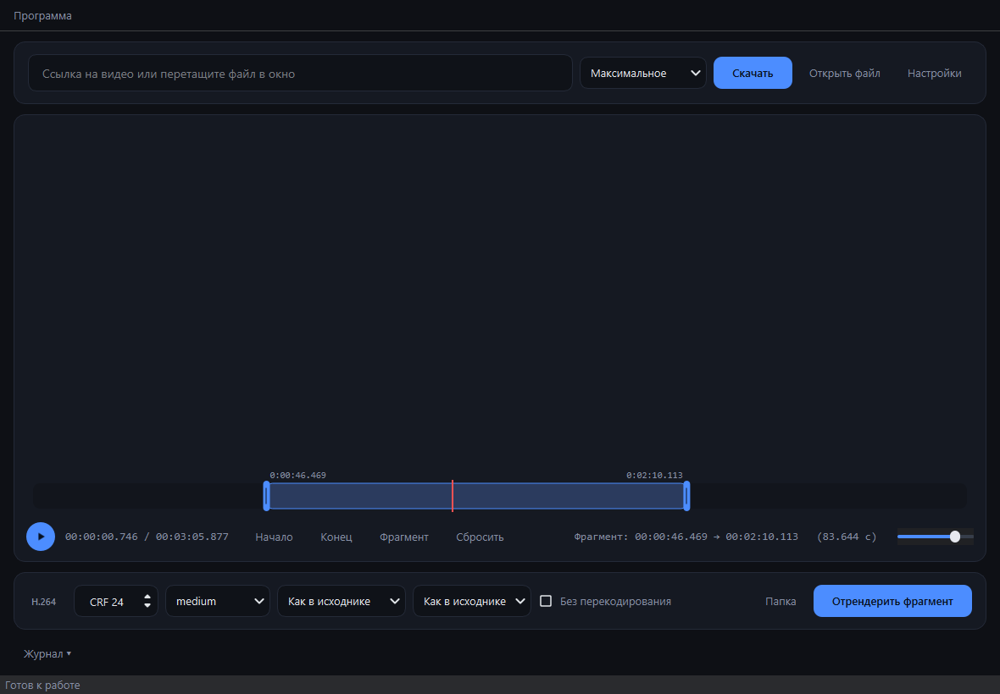

<div align="center">


# Clipper

**Ссылка → видео → нужный кусок → MP4/H.264.**
Windows и macOS. Без установки, без рекламы, без облаков.

[](https://github.com/Kostido/Clipper/releases/latest)
[](https://github.com/Kostido/Clipper/actions)
[](https://github.com/Kostido/Clipper/releases)



</div>

## Скачать

| Файл | Система |
|------|---------|
| [`Clipper.exe`](https://github.com/Kostido/Clipper/releases/latest) | Windows 10/11 — один файл |
| [`Clipper-portable-win64.zip`](https://github.com/Kostido/Clipper/releases/latest) | Windows — настройки и загрузки в своей папке |
| [`Clipper-macos.zip`](https://github.com/Kostido/Clipper/releases/latest) | macOS 11+ — внутри `Clipper.app` |

> macOS: первый запуск — правый клик по `Clipper.app` → **Открыть** (нет подписи Apple).
> Если YouTube ругается на встроенные компоненты:
> `xattr -dr com.apple.quarantine /Applications/Clipper.app`

## Как работать

1. Вставьте ссылку → **Скачать**. Или перетащите файл в окно.
2. Растяните синие метки на дорожке — это и есть фрагмент.
3. **Отрендерить фрагмент** → готовый MP4.

Плей всегда играет выделенное: начинает с метки начала, встаёт на метке конца.
Пока тянете метку, в плеере виден кадр под ней.

| Клавиша | Действие |
|---------|----------|
| `I` / `O` | начало / конец фрагмента по текущей позиции |
| `Пробел` | играть / пауза |
| `←` `→` | шаг 1 с (с `Shift` — 0,1 с) |

## Возможности

- **~1000 сайтов** через yt-dlp: YouTube, Vimeo, TikTok, Instagram, VK, X.
- **Всё внутри**: ffmpeg, движок JavaScript и генератор PO-токенов для YouTube.
- **H.264 + AAC** приоритетом — файл играется везде и режется без перекодирования.
- **Рендер**: CRF, preset, разрешение, fps. Или режим «без перекодирования» — мгновенно.
- **Cookies** для видео «только после входа»: сами из браузера, кэш по домену, файл `cookies.txt`.
- **Автообновление** из релизов GitHub (Windows).

## Если не качает

| Симптом | Что делает программа | Что сделать вам |
|---------|----------------------|-----------------|
| `403` на YouTube | Сама предъявляет PO-токен и меняет клиента | Ничего |
| «Нужны cookies» | Перебирает установленные браузеры, кэширует | Войти на сайт и **закрыть браузер** один раз |
| Chrome не отдал cookies | — | Экспортировать `cookies.txt` (расширение «Get cookies.txt LOCALLY») → **Настройки** |
| Таймауты, мёртвый прокси | Повтор напрямую и по IPv4 | Включить VPN, если сайт недоступен |
| TikTok отдаёт заглушку | Пробует обычный TLS с браузерными заголовками | Прописать другой прокси в **Настройках** — блок по IP датацентров не обойти |
| Видео чёрное в плеере | Готовит H.264-превью, рендер идёт из оригинала | Ничего |
| macOS: «Operation not permitted» | Пропускает недоступный браузер, берёт следующий | Для cookies Safari — **Полный доступ к диску** (меню «Программа → Доступ к cookies…») |
| macOS: cookies не расшифровались | Сообщает, что ключ в Связке ключей | Разрешить доступ во всплывающем запросе macOS |

Диагностика: `Clipper.exe --selftest report.txt` — покажет, что нашлось внутри сборки.
Добавьте `--download <ссылка>` для проверки скачивания.

## Портативный режим

Файл `portable.txt` рядом с программой → всё своё в её папке, реестр не трогается:

```
ClipperData/settings.ini    настройки
ClipperData/cookies/        cookies сайтов
Downloads/                  скачанное
```

Удалите файл — вернётся обычный режим. Работает и с обычным `Clipper.exe`.

## Сборка

```bat
build_windows.bat          :: Windows: dist\Clipper.exe + портативный архив
```

```sh
./build_macos.sh           # macOS: dist/Clipper.app
```

Скрипты сами создают venv, ставят зависимости и качают ffmpeg, `qjs`,
`rustypipe-botguard` в `bin/`. Нужен Python 3.10+.

Из исходников: `run.bat` (Windows) либо `pip install -r requirements.txt && python main.py`.

## Релизы

Пуш тега собирает всё в CI и прикрепляет к релизу:

```bat
git tag v1.3.0 && git push origin v1.3.0
```

Автообновление ищет ассеты `Clipper.exe` и `Clipper-macos.zip`.
На macOS программа себя не подменяет — открывает страницу релизов.

## Структура

```
main.py                 точка входа
clipper/app.py          окно и логика
clipper/timeline.py     дорожка с метками фрагмента
clipper/downloader.py   yt-dlp, cookies, обход блокировок
clipper/ffmpeg_tools.py probe, рендер, H.264-превью
clipper/updater.py      обновление из релизов
clipper/storage.py      пути: обычный и портативный режимы
tools/                  загрузка ffmpeg и инструментов, иконки, портатив
```

---

Скачивайте только то, на что у вас есть права: авторский контент и условия
использования сайтов никто не отменял.
